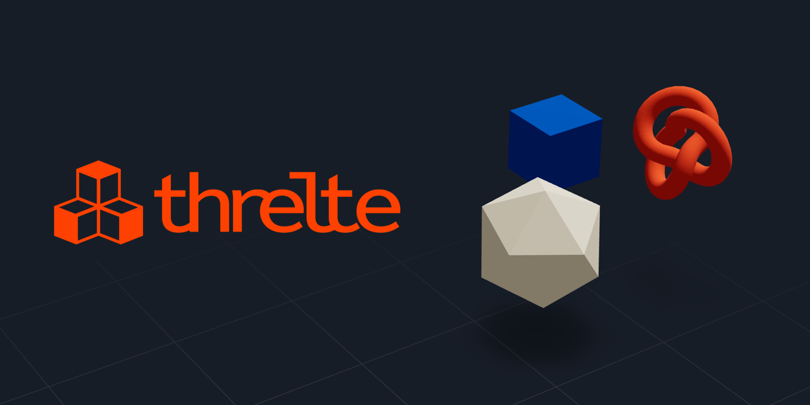

<div align="right">
 
 
 
 
</div>

<a href="https://next.threlte.xyz">
 
</a>

## Rapidly Build Interactive 3D Apps for the Web

Threlte is a [Svelte](https://svelte.dev/) library that simplifies creating 3D apps for the web. It provides a **declarative**, **type-safe**, **reactive** and **interactive** API out-of-the-box.

Threlte's **3D rendering** is powered by [Three.js](https://threejs.org/), and it also provides a **physics engine** through [Rapier](https://rapier.rs/) and an **animation studio** via [Theatre.js](https://www.theatrejs.com/); see [packages](#packages) for details.

Check out our **[documentation](https://next.threlte.xyz)** and our **[Discord community](https://discord.gg/EqUBCfCaGm)**.

## create-threlte

This is the official [npm create](https://docs.npmjs.com/cli/v6/commands/npm-init) command for Threlte projects.

## Usage

To use `create-threlte` to initialize a fresh Threlte project, run:

```sh
npm create threlte my-project
```

You well then enter an interactive prompt that allows you to select options for configuring both SvelteKit and Threlte.

### Support

Have questions? Feel free to ask in our [Discord support forum](https://discord.com/channels/985983540804091964/1031843197963477002).

## Contributing

Contributions are what make the open source community such an amazing place to learn, inspire, and create. Any contributions you make are **greatly appreciated**.

- **Filing Issues** - if you have feature requestions or you think you spotted a bug, [submit an issue](https://github.com/threlte/threlte/issues/new).
- **Contributing Code** - if you would like to drop us a PR, read the [contribution guide](https://github.com/threlte/threlte/blob/main/CONTRIBUTING.md) first.

## Sponsors

[](https://vercel.com/?utm_source=threlte&utm_campaign=oss)

---

### License

The MIT License (MIT). Please see the [License File](LICENSE.md) for more information.
